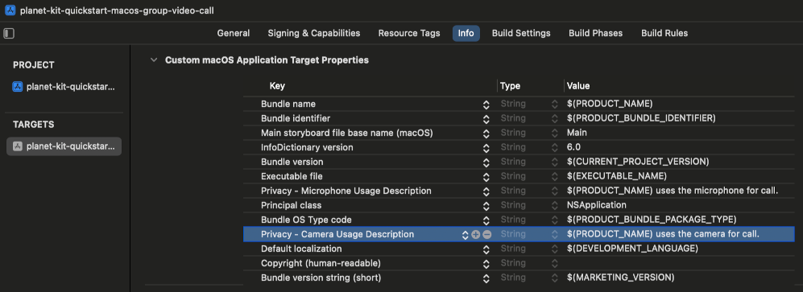
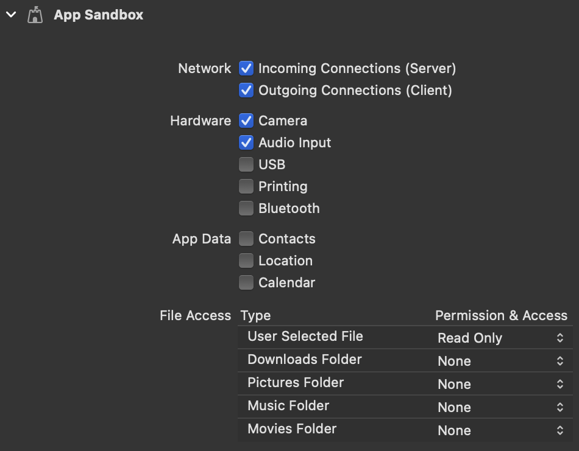
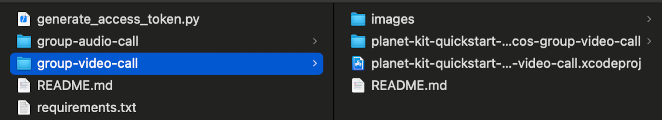
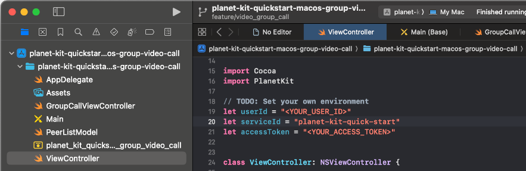
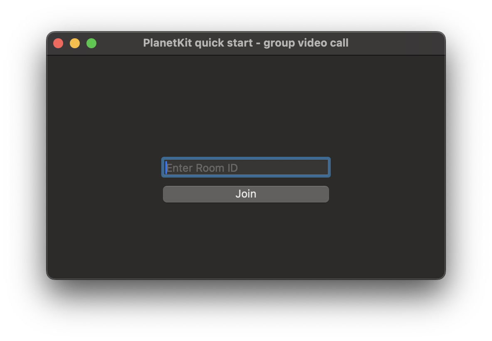
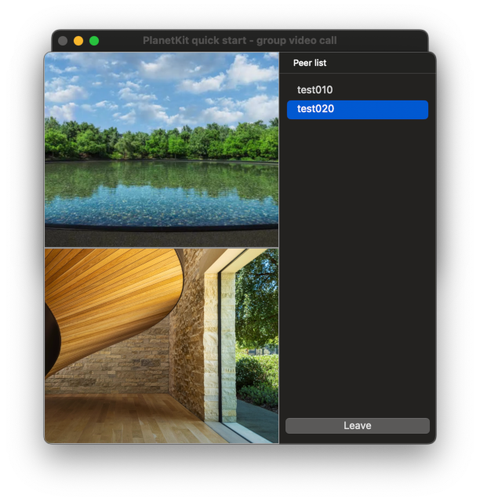

# PlanetKit quick start for macOS (Group Video Call)

This repository provides a quick start project implemented with PlanetKit for macOS.

> This quick start project is based on PlanetKit 6.0.x.

## Planet Documentation

[LINE Planet Documentation](https://docs.lineplanet.me/) provides additional resources to help you integrate LINE Planet into your service. These resources include LINE Planet specifications, developer guides for each client platform, and server API references.

## About PlanetKit SDK

PlanetKit is a client SDK for LINE Planet, which is a cloud-based real-time communications platform as a service (CPaaS) that helps you build a voice and video call environment. With LINE Planet, you can integrate call features into your service at minimum cost.

### PlanetKit system requirements

The system requirements of PlanetKit for macOS are as follows.

#### Operating system requirements

- macOS 10.14.6 or higher

#### Required runtime permissions

##### Information Property List

- [`NSMicrophoneUsageDescription`](https://developer.apple.com/documentation/bundleresources/information_property_list/nsmicrophoneusagedescription)
- [`NSCameraUsageDescription`](https://developer.apple.com/documentation/bundleresources/information_property_list/nscamerausagedescription)



##### App Sandbox entitlements

###### Network

- [`com.apple.security.network.server`](https://developer.apple.com/documentation/bundleresources/entitlements/com_apple_security_network_server)
- [`com.apple.security.network.client`](https://developer.apple.com/documentation/bundleresources/entitlements/com_apple_security_network_client)

###### Hardware

- [`com.apple.security.device.camera`](https://developer.apple.com/documentation/bundleresources/entitlements/com_apple_security_device_camera)
- [`com.apple.security.device.microphone`](https://developer.apple.com/documentation/bundleresources/entitlements/com_apple_security_device_microphone)



### How to install the SDK

- [Installation](https://github.com/line/planet-kit-apple?tab=readme-ov-file#installation)

### References

- [PlanetKit system requirements](https://docs.lineplanet.me/overview/specification/planetkit-system-requirements#macos)
- [API Reference](https://docs.lineplanet.me/api-reference/client/macos/6.0/index.html)

### Release information

- [API changelog](https://docs.lineplanet.me/macos/reference/api-changelog)
- [Release notes](https://docs.lineplanet.me/macos/reference/release-notes)

## Using the quick start project

This quick start project provides basic functionality of a **group video call**.

### Prerequisites

- Xcode 16 or higher
- Python 3.8 or higher
  - To generate an access token, you need [a supported version of Python 3.x](https://www.python.org/downloads/), currently 3.8 or higher.

### 1. Download source code

Clone this repository, or download this repository and unzip the files.

### 2. Open the project

Open Xcode project `planet-kit-quickstart-macos-group-video-call.xcodeproj` with Xcode.



### 3. Generate an access token

> In this quick start project, we provide a script that generates an access token for your convenience. However, during the actual implementation of your app, the access token must be created in the AppServer. For more information, refer to [Access token](https://docs.lineplanet.me/getting-started/essentials/access-token).

Generate an [access token](https://docs.lineplanet.me/getting-started/essentials/access-token) using `generate_access_token.py`.

- The script requires a valid user ID as an argument. For the naming restrictions of a user ID, see [User ID](https://docs.lineplanet.me/overview/glossary#user-id).
- Python package requirement for `generate_access_token.py` can be found in `requirements.txt`.
  - You can use the command `pip3 install -r requirements.txt` to install required packages.

> We recommend using a virtual environment for this step. For more information, see [how to use venv](https://packaging.python.org/en/latest/guides/installing-using-pip-and-virtual-environments/).

```console
user@test planet-kit-quickstart-macos % python3 generate_access_token.py <YOUR_USER_ID>
access token:  <GENERATED_ACCESS_TOKEN>
```

### 4. Apply the user ID and the access token

Copy and paste the user ID and access token into your code.

```Swift
// ViewController.swift

// TODO: Set your own environment
let userId = "<YOUR_USER_ID>"
let serviceId = "planet-kit-quick-start"
let accessToken = "<GENERATED_ACCESS_TOKEN>"

....
```

### 5. Run the project

Run the quick start project on current macOS device.



### 6. Join a group video call

Enter a room ID and click **Join** to join the group call.

> To join the call successfully, you need to enter a valid room ID. For the naming restrictions of a room ID, see [Room ID](https://docs.lineplanet.me/overview/glossary#room-id).



Once you're connected to the call, you can communicate with other participants. 

### 7. Request video of a peer

While connected to the group video call, click on a peer from the peer list to request their video.

> By default, video streams are not displayed automatically; you must manually select a peer from the list to view their video stream.



### 8. Leave a group video call

Click **Leave** to leave the group call.

## Troubleshooting

If the group call cannot be connected, please check [PlanetKitStartFailReason](https://docs.lineplanet.me/api-reference/client/macos/6.0/Enums/PlanetKitStartFailReason.html) and [PlanetKitDisconnectReason](https://docs.lineplanet.me/api-reference/client/macos/6.0/Enums/PlanetKitDisconnectReason.html).

```Swift
// check PlanetKitStartFailReason
// ViewController.swift
....
class ViewController: NSViewController {
    ....

    @objc private func joinButtonTapped() {
        ....

        let myUserId = PlanetKitUserId(id: userId, serviceId: serviceId)
        let param = PlanetKitConferenceParam(myUserId: myUserId, roomId: roomId, roomServiceId: serviceId, displayName: nil, delegate: groupCallVC, accessToken: accessToken)
        param.mediaType = .audiovideo
        
        let result = PlanetKitManager.shared.joinConference(param: param, settings: nil)
        print("join conference result: \(result.reason)")

        ....        
    }
}
```

```Swift
// check PlanetKitDisconnectReason
// GroupCallViewController.swift
....
extension GroupCallViewController: PlanetKitConferenceDelegate {
    ....

    func didDisconnect(_ conference: PlanetKitConference, disconnected param: PlanetKitDisconnectedParam) {
        DispatchQueue.main.async {
            print("disconnected: \(param.reason)")
            
            self.showAlert("Disconnected", message: "reason: \(param.reason), source: \(param.source)")
            self.dismiss(self)
        }
    }

    ....
}
```

## Issues and inquiries

Please file any issues or inquiries you have to our representative or [dl\_planet\_help@linecorp.com](mailto:dl_planet_help@linecorp.com). Your opinions are always welcome.

## FAQ

You can find answers to our frequently asked questions in the [FAQ](https://docs.lineplanet.me/help/faq) section.
